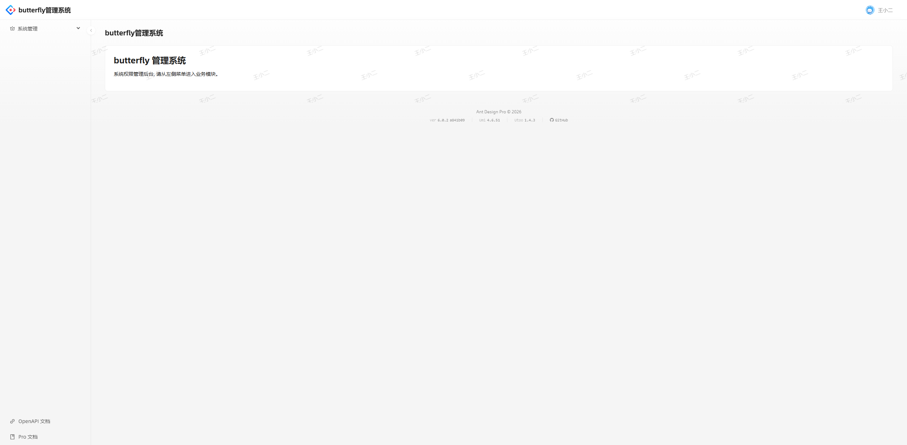
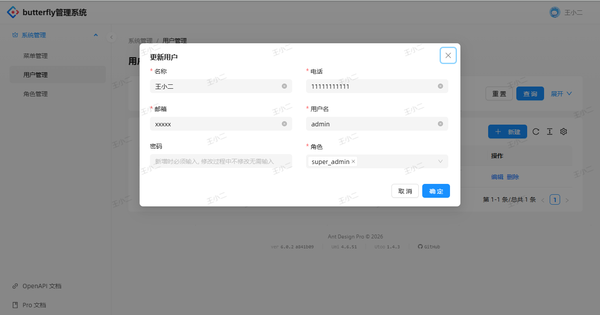
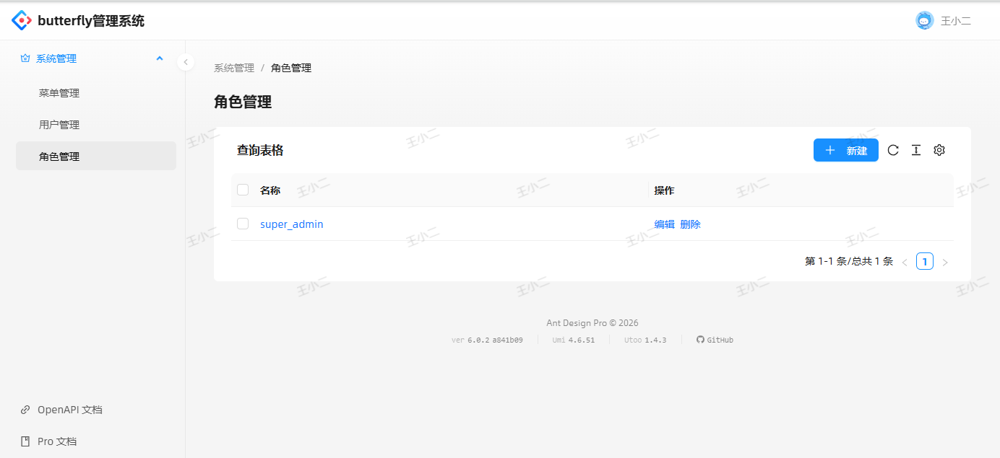
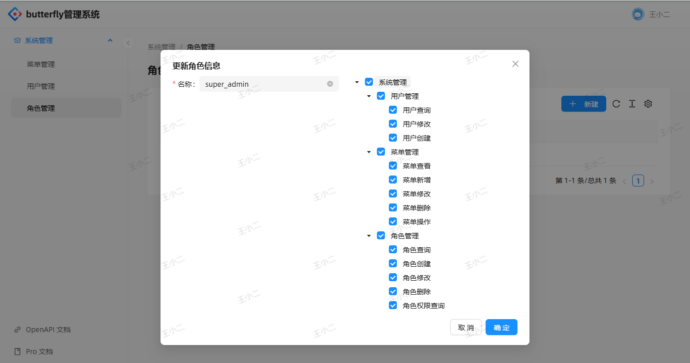

# Butterfly Admin Web

基于 [Ant Design Pro](https://pro.ant.design) / [Umi Max](https://umijs.org) 的企业后台管理系统前端, 是https://github.com/pwh19920920/butterfly-admin
的配套项目。

当前版本：`6.0.2`（Pro v6 升级分支）


## 相关项目

| 项目 | 说明 | 地址 |
|------|------|------|
| butterfly | 基础框架库（Gin 封装） | https://github.com/pwh19920920/butterfly |
| butterfly-admin | 后端 API 服务（本仓库） | https://github.com/pwh19920920/butterfly-admin |


## 界面预览


### 登录


### 欢迎页



### 用户管理




### 角色管理





### 菜单管理


## 技术栈

| 类别 | 技术 |
|------|------|
| 框架 | React 19、Umi Max 4、TypeScript |
| UI | Ant Design 6、Pro Components 3 |
| 样式 | Tailwind CSS 4、antd-style |
| 数据请求 | Umi request、@tanstack/react-query |
| 代码规范 | Biome、Husky、Commitlint、lint-staged |
| 测试 | Jest、Testing Library |
| 部署 | Docker multi-stage + Nginx |

## 环境要求

- Node.js `>= 20`
- 包管理器：npm（项目以 `package-lock.json` 为准）

## 快速开始

```bash
# 安装依赖
npm install

# 启动开发服务（默认代理到本地后端）
npm start
# 或
npm run dev
```

浏览器访问：http://localhost:8000

### 开发代理

开发环境将 `/api/` 代理到后端，配置见 `config/proxy.ts`：

| 环境 | 目标 |
|------|------|
| dev / test | `http://localhost:8088` |
| pre | 需自行配置 |

不需要 Mock 时使用：

```bash
npm run start:no-mock
```

## 常用脚本

| 命令 | 说明 |
|------|------|
| `npm start` / `npm run dev` | 启动开发服务 |
| `npm run build` | 生产构建，产物输出到 `dist/` |
| `npm run preview` | 预览已构建产物 |
| `npm run preview:build` | 先构建再预览 |
| `npm run lint` | Biome lint + TypeScript 类型检查 |
| `npm run biome` | Biome 检查并自动修复 |
| `npm run tsc` | 仅 TypeScript 类型检查 |
| `npm test` | 单元测试 |
| `npm run test:coverage` | 测试覆盖率 |
| `npm run analyze` | 构建产物体积分析 |
| `npm run doctor` | react-doctor 代码体检 |
| `npm run i18n-remove` | 一次性移除 i18n，改为中文硬编码（**不可逆**） |

## 目录结构

```text
butterfly-admin-web
├── config/                 # Umi 配置
│   ├── config.ts           # 主配置
│   ├── routes.ts           # 路由
│   ├── proxy.ts            # 开发代理
│   └── defaultSettings.ts  # 布局默认设置
├── public/                 # 静态资源
├── scripts/                # 脚手架工具脚本（非运行时）
├── src/
│   ├── access.ts           # 权限定义
│   ├── app.tsx             # 运行时配置（layout、getInitialState 等）
│   ├── components/         # 公共组件
│   ├── locales/            # 国际化文案
│   ├── pages/              # 页面
│   │   ├── Welcome.tsx
│   │   ├── SysMenu/        # 菜单管理
│   │   ├── SysRole/        # 角色管理
│   │   ├── SysUser/        # 用户管理
│   │   └── user/login/     # 登录
│   ├── services/           # API 服务
│   └── ...
├── biome.json              # Biome 配置
├── Dockerfile              # 镜像构建
├── default.conf.template   # Nginx 配置模板
├── package.json
└── tsconfig.json
```

## 路由与权限

路由配置：`config/routes.ts`

- `/user/login`：登录页（无布局）
- `/welcome`：欢迎页
- `/sys/*`：系统管理（菜单 / 角色 / 用户）

系统管理路由开启了 `access: 'routeAccess'`，依赖当前用户权限码 `currentUser.codes` 与路由 `name` 匹配，详见 `src/access.ts`。

## 代码规范

- **Lint / Format**：Biome（已替代 ESLint / Prettier）
- **提交前检查**：Husky + lint-staged（暂存文件自动 `biome check --write`）
- **提交信息**：Commitlint + Conventional Commits

```bash
# 手动检查
npm run lint

# 自动修复
npm run biome
```

提交信息示例：

```text
feat(sys): 新增用户批量禁用
fix(login): 退出后正确跳转原页面
```

## Docker 部署

镜像采用多阶段构建：Node 构建前端 → Nginx 托管静态资源，`/api` 由 Nginx 反代到后端。

```bash
# 构建镜像
docker build -t butterfly-admin-web .

# 运行（需按环境注入 NGINX_UPSTREAM 等变量）
docker run -d -p 80:80 \
  -e NGINX_UPSTREAM="server backend:8088;" \
  butterfly-admin-web
```

- 构建阶段：`npm ci --legacy-peer-deps` + `npm run build`
- 运行阶段：Nginx，配置模板为 `default.conf.template`
- SPA 路由通过 `try_files` 回退到 `index.html`

## 相关文档

- [Ant Design Pro](https://pro.ant.design)
- [Umi Max](https://umijs.org)
- [Ant Design](https://ant.design)
- [Biome](https://biomejs.dev)
